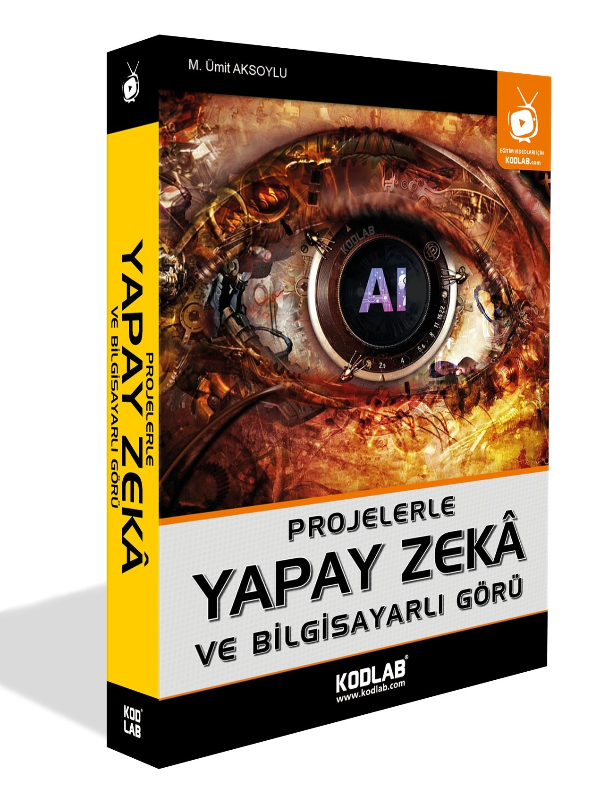

<h2 align="center">"Projelerle Yapay Zeka Ve Bilgisayarlı Görü" Kitabımın projeleri </h2><h3>  

   

#### Bu Github Reposundaki tüm projeler; kaleme almış olduğum "Projelerle Yapay Zekâ ve Bilgisayarlı Görü" kitabında satır satır, detaylıca anlatılmaktadır.
#### Kitabı satın almak için;

- D&R : [Satın Al](https://www.dr.com.tr/Kitap/Projelerle-Yapay-Zeka-Ve-Bilgisayarli-Goru/Egitim-Basvuru/Bilgisayar/urunno=0001940384001)
- KODLAB : [Satın Al](https://www.kodlab.com/programlama/597-projelerle-yapay-zeka-ve-bilgisayarli-goru-9786257440196.html)
- IDEFIX : [Satın Al](https://www.idefix.com/kitap/projelerle-yapay-zeka-ve-bilgisayarli-goru/egitim-basvuru/bilgisayar/urunno=0001940384001)

  
<h1 align="center">===KİTAPTAKİ PROJELER===</h1>

  
## 💭 [2. Similarity Algorithms](https://github.com/Aksoylu/KODLAB-Projects/tree/main/2.%20Similarity%20Algorithms)
- Cosinus Similarity [Go Project](https://github.com/Aksoylu/KODLAB-Projects/tree/main/2.%20Similarity%20Algorithms/Cosinus%20Similarity)
- Levenshtein Similarity [Go Project](https://github.com/Aksoylu/KODLAB-Projects/tree/main/2.%20Similarity%20Algorithms/Levenshtein%20Similarity)
- Vector Spaces Similarity [Go Project](https://github.com/Aksoylu/KODLAB-Projects/tree/main/2.%20Similarity%20Algorithms/Vector%20Spaces%20Similarity)
- Matrix Similarity [Go Project](https://github.com/Aksoylu/KODLAB-Projects/tree/main/2.%20Similarity%20Algorithms/matrix%20Similarity)

## 🧠 [3. Fuzzy Logic](https://github.com/Aksoylu/KODLAB-Projects/tree/main/3.%20Fuzzy%20Logic/Fuzzy%20Logic%20Control%20Unit)
- Fuzzy Logic Control Unit [Go Project](https://github.com/Aksoylu/KODLAB-Projects/tree/main/3.%20Fuzzy%20Logic/Fuzzy%20Logic%20Control%20Unit)

## 👨‍💻 [4. Base Machine Learning](https://github.com/Aksoylu/KODLAB-Projects/tree/main/4.%20Base%20Machine%20Learning)
- Desicion Trees [Go Project](https://github.com/Aksoylu/KODLAB-Projects/tree/main/4.%20Base%20Machine%20Learning/Desicion%20Trees)
- K-Means Algorithm [Go Project](https://github.com/Aksoylu/KODLAB-Projects/tree/main/4.%20Base%20Machine%20Learning/K-Means%20Algorithm)
- KNN Algorithm [Go Project](https://github.com/Aksoylu/KODLAB-Projects/tree/main/4.%20Base%20Machine%20Learning/KNN%20Algorithm)
- Korelasyon-Regresyon [Go Project](https://github.com/Aksoylu/KODLAB-Projects/tree/main/4.%20Base%20Machine%20Learning/Korelasyon-Regresyon)
- Linear Regresyon [Go Project](https://github.com/Aksoylu/KODLAB-Projects/tree/main/4.%20Base%20Machine%20Learning/Linear%20Regresyon)
- Lojistik Regresyon [Go Project](https://github.com/Aksoylu/KODLAB-Projects/tree/main/4.%20Base%20Machine%20Learning/Lojistik%20Regresyon)
- Multiple Linear Regression [Go Project](https://github.com/Aksoylu/KODLAB-Projects/tree/main/4.%20Base%20Machine%20Learning/Multiple%20Linear%20Regression)
- Polinom Regression Algorithm [Go Project](https://github.com/Aksoylu/KODLAB-Projects/tree/main/4.%20Base%20Machine%20Learning/PolinomRegression)
- Support Vector Machines Algorithm [Go Project](https://github.com/Aksoylu/KODLAB-Projects/tree/main/4.%20Base%20Machine%20Learning/Support%20Vector%20Machines%20Algorithm)

## 🤖 [6. Natural Language Processing](https://github.com/Aksoylu/KODLAB-Projects/tree/main/6.%20Natural%20Language%20Processing)  
- Sahte ve gerçek haberleri ayırt eden yapay zeka [Go Project](https://github.com/Aksoylu/KODLAB-Projects/tree/main/6.%20Natural%20Language%20Processing/1.Proje)
- Ürünlere yorum üreten yapay zeka [Go Project](https://github.com/Aksoylu/KODLAB-Projects/tree/main/6.%20Natural%20Language%20Processing/2.Proje)

## 👁 [7. Computer Vision](https://github.com/Aksoylu/KODLAB-Projects/tree/main/7.%20Computer%20Vision)
- Altın Oran Hesaplayan Bir Makine Öğrenmesi Modeli [Go Project](https://github.com/Aksoylu/KODLAB-Projects/tree/main/7.%20Computer%20Vision/Alt%C4%B1n%20Oran)
- Göz ile fare kontrolü [Go Project](https://github.com/Aksoylu/KODLAB-Projects/tree/main/7.%20Computer%20Vision/G%C3%B6z%20ile%20fare%20kontrol%C3%BC)
- Haar Cascade Sınıflandırıcıları [Go Project](https://github.com/Aksoylu/KODLAB-Projects/tree/main/7.%20Computer%20Vision/Haar%20Cascade%20S%C4%B1n%C4%B1fland%C4%B1r%C4%B1c%C4%B1s%C4%B1)
- Kenar Tespiti Uygulamaları [Go Project](https://github.com/Aksoylu/KODLAB-Projects/tree/main/7.%20Computer%20Vision/Kenar%20Tespiti%20Uygulamalar%C4%B1)
- Merhaba OpenCV [Go Project](https://github.com/Aksoylu/KODLAB-Projects/tree/main/7.%20Computer%20Vision/Merhaba%20OpenCV)
- Numpy ile görüntü işleme [Go Project](https://github.com/Aksoylu/KODLAB-Projects/tree/main/7.%20Computer%20Vision/Numpy%20ile%20g%C3%B6r%C3%BCnt%C3%BC%20i%C5%9Fleme)
- OpenCV Örnekleri [Go Project](https://github.com/Aksoylu/KODLAB-Projects/tree/main/7.%20Computer%20Vision/OpenCV%20%C3%96rnekleri)
- Optik Okuyucu [Go Project](https://github.com/Aksoylu/KODLAB-Projects/tree/main/7.%20Computer%20Vision/Optik%20Okuyucu)
- PIL ile görüntü işleme [Go Project](https://github.com/Aksoylu/KODLAB-Projects/tree/main/7.%20Computer%20Vision/PIL%20ile%20g%C3%B6r%C3%BCnt%C3%BC%20i%C5%9Fleme)
- Renk Uzayı Dönüşümleri [Go Project](https://github.com/Aksoylu/KODLAB-Projects/tree/main/7.%20Computer%20Vision/Renk%20Uzay%C4%B1%20D%C3%B6n%C3%BC%C5%9F%C3%BCmleri)
- Renk takibi [Go Project](https://github.com/Aksoylu/KODLAB-Projects/tree/main/7.%20Computer%20Vision/Renk%20takibi)
- Scikit-Image ile görüntü işleme [Go Project](https://github.com/Aksoylu/KODLAB-Projects/tree/main/7.%20Computer%20Vision/Scikit-Image%20ile%20g%C3%B6r%C3%BCnt%C3%BC%20i%C5%9Fleme)
  
- Sınır ve Şekil Tespiti [Go Project](https://github.com/Aksoylu/KODLAB-Projects/tree/main/7.%20Computer%20Vision/S%C4%B1n%C4%B1r%20ve%20%C5%9Eekil%20Tespiti)
- Yüz işlemleri [Go Project](https://github.com/Aksoylu/KODLAB-Projects/tree/main/7.%20Computer%20Vision/Y%C3%BCz%20i%C5%9Flemleri)
- Plaka okuma [Go Project](https://github.com/Aksoylu/KODLAB-Projects/tree/main/7.%20Computer%20Vision/plaka%20okuma)
- Şablon Eşleme [Go Project](https://github.com/Aksoylu/KODLAB-Projects/tree/main/7.%20Computer%20Vision/%C5%9Eablon%20E%C5%9Fleme)

